# Rwanda Food Security Analysis

This project on how we can analyze packaged food products to assess their nutritional value and identify unhealthy trends in consumer diets?
## Table of Contents
- [Project Overview](#project-overview)
- [Data Sources](#data-sources)
- [Methodology](#methodology)
- [Key Findings](#key-findings)

## Project Overview

This capstone project examines the complex relationships between dietary energy supply, economic factors, agricultural indicators, and nutrition outcomes in Rwanda from 2000-2024. The analysis includes:

- Trend analysis of key food security indicators
- Correlation analysis between economic and nutrition factors
- Machine learning model to predict undernourishment
- Time series forecasting of future food security status
- Creation of a composite Food Security Index

## Data Sources

Primary dataset: FAOSTAT Suite of Food Security Indicators for Rwanda (`FAOSTAT_data_en_7-29-2025.csv`)

Key indicators analyzed:
- Prevalence of undernourishment
- Dietary energy supply
- GDP per capita
- Child stunting rates
- Cereal import dependency
- And 20+ other food security metrics

## Methodology

1. **Data Cleaning & Preprocessing**
   - Handled missing values and estimated data points
   - Standardized year formats
   - Converted values to numeric types
   - Filtered relevant indicators

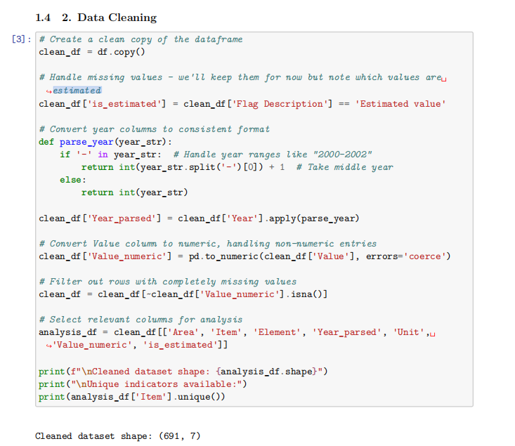

2. **Exploratory Data Analysis**
   - Time series trends visualization
   - Correlation matrix of key indicators
   - Scatter plots of relationships

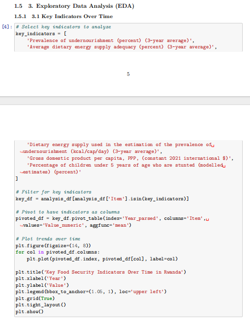

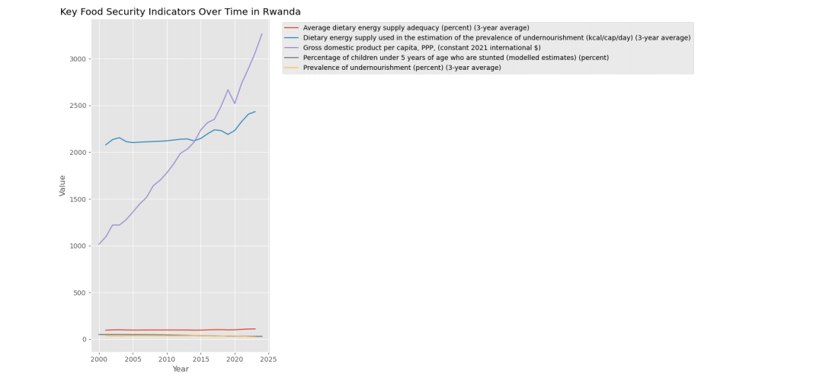

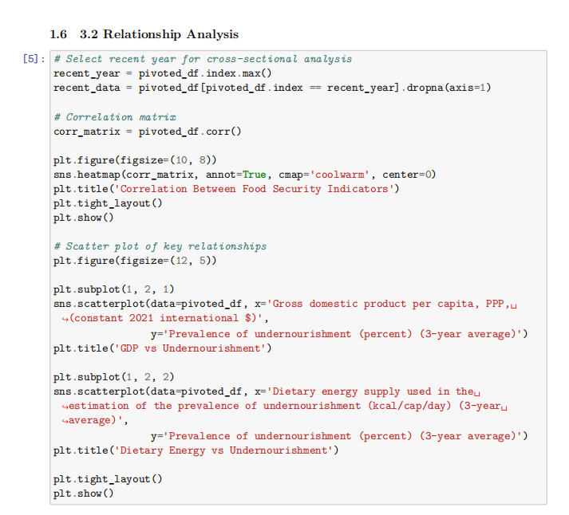

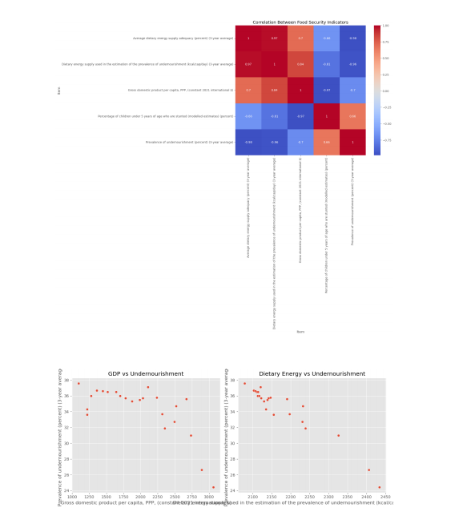

3. **Machine Learning**
   - Random Forest regression to predict undernourishment
   - Feature importance analysis
   - Model evaluation (R² = 0.61)

     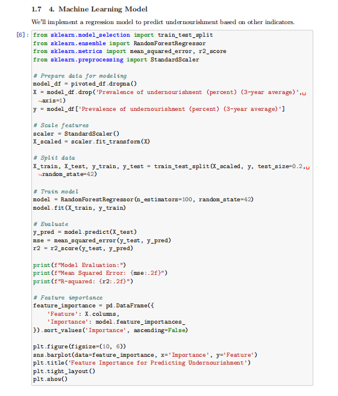

     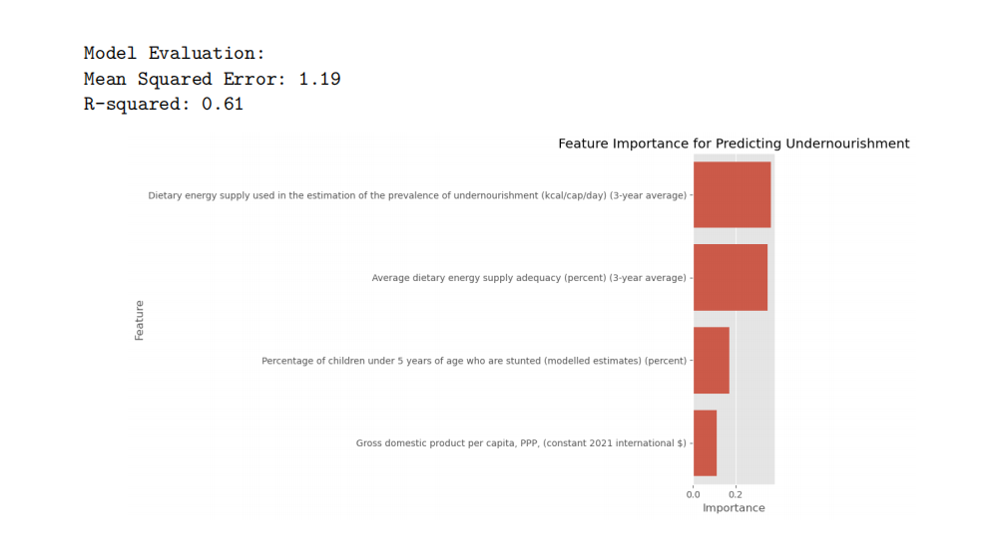

4. **Time Series Forecasting**
   - ARIMA model for undernourishment prevalence
   - 5-year forecast of food security trends
  
      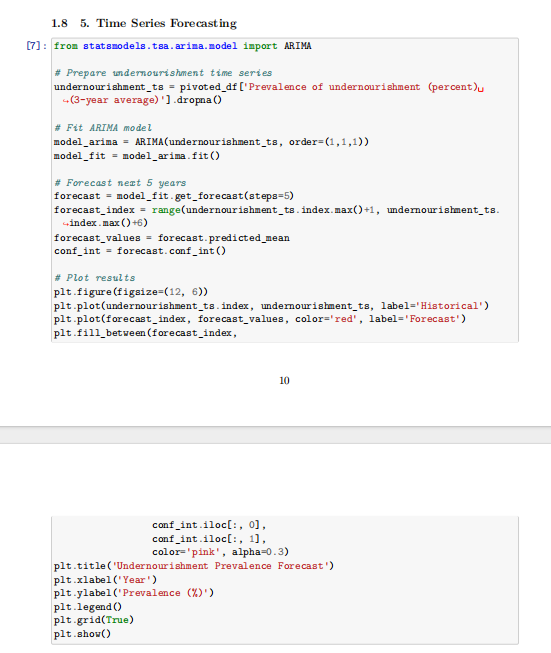

     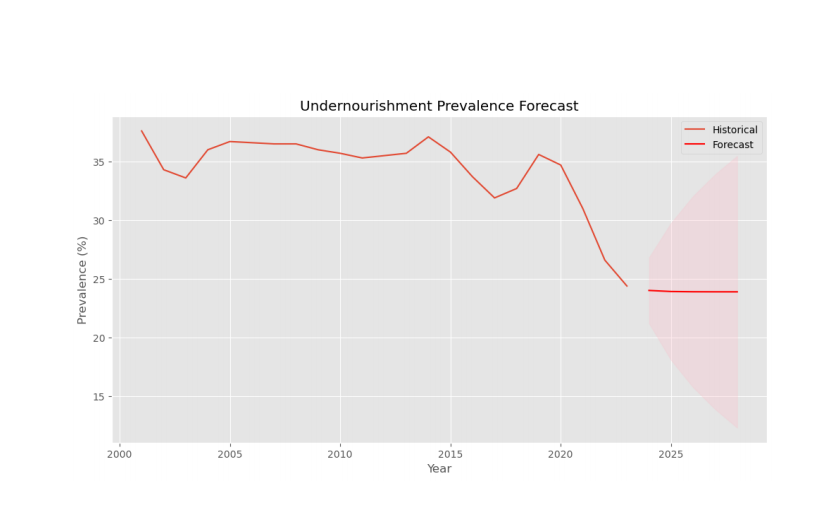

5. **Composite Index Creation**
   - Combined multiple indicators into single Food Security Index
   - Normalized and weighted components
  
      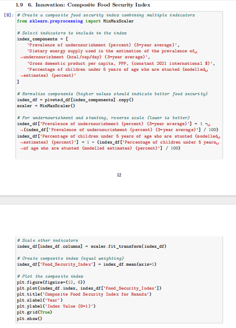

     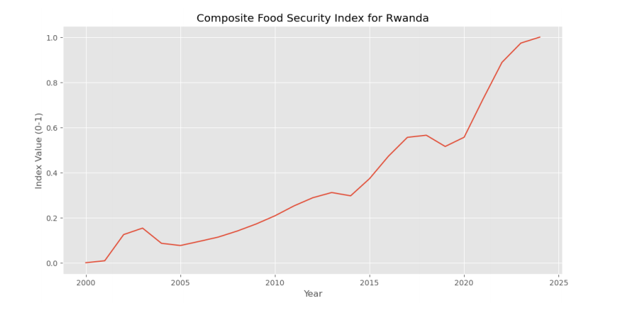

## Key Findings

- Undernourishment decreased from 37.6% (2000-2002) to 24.4% (2022-2024)
- Strong negative correlation between GDP and undernourishment (-0.89)
- Dietary energy supply increased from 2079 to 2434 kcal/cap/day
- Child stunting rates declined from 48.7% to 30.5%
- Model predicts undernourishment may reach ~20% by 2028
- Food Security Index improved from 0.38 (2001) to 0.62 (2023)

